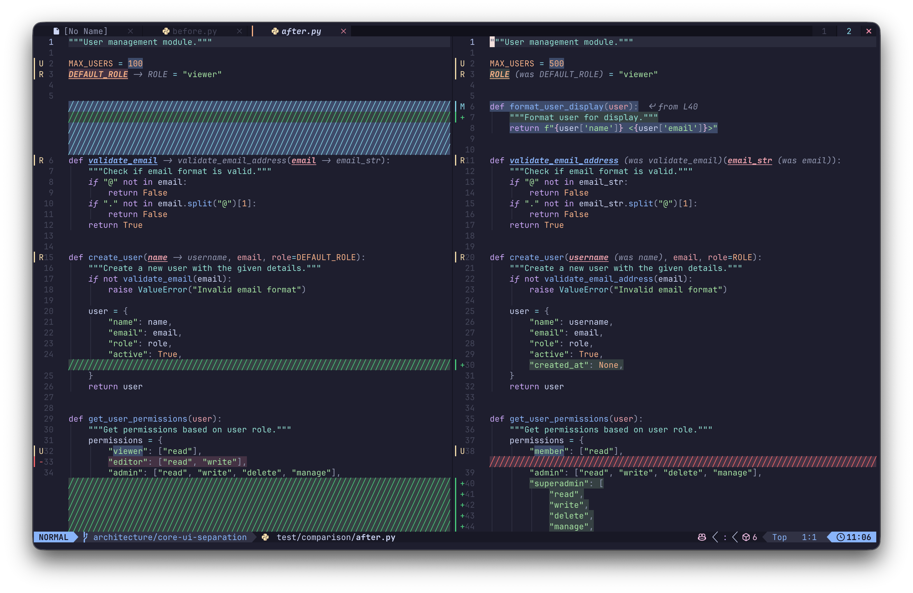

<p align="center">
  <picture>
    <source media="(prefers-color-scheme: dark)" srcset="images/logo-dark.png">
    
  </picture>
</p>

Semantic diff for Neovim using Tree-sitter. Understands code structure to detect moved functions, updated blocks, and real changes, not just line differences.



## Features

- **Move detection** — Knows when code blocks are moved, not deleted and re-added
- **Update detection** — Highlights modified code in place
- **Insert/Delete detection** — Shows new and removed code
- **Language agnostic** — Works with any language that has a Tree-sitter parser

## Installation

Using [lazy.nvim](https://github.com/folke/lazy.nvim):

```lua
{
    "HarshK97/diffmantic.nvim",
    config = function()
        require("diffmantic").setup()
    end,
}
```

## Usage

Compare two files:

```vim
:Diffmantic path/to/file1 path/to/file2
```

Compare current buffer with another file:

```vim
:Diffmantic path/to/other_file
```

## How It Works

Implements the [GumTree algorithm](https://hal.science/hal-04855170v1/file/GumTree_simple__fine_grained__accurate_and_scalable_source_differencing.pdf) for AST matching:

1. **Top-down matching** — Finds identical subtrees by hash
2. **Bottom-up matching** — Matches parents based on mapped children
3. **Recovery matching** — LCS-based matching for remaining nodes

## Requirements

- Neovim 0.9+
- Tree-sitter parser for the language you're diffing

## License

MIT
