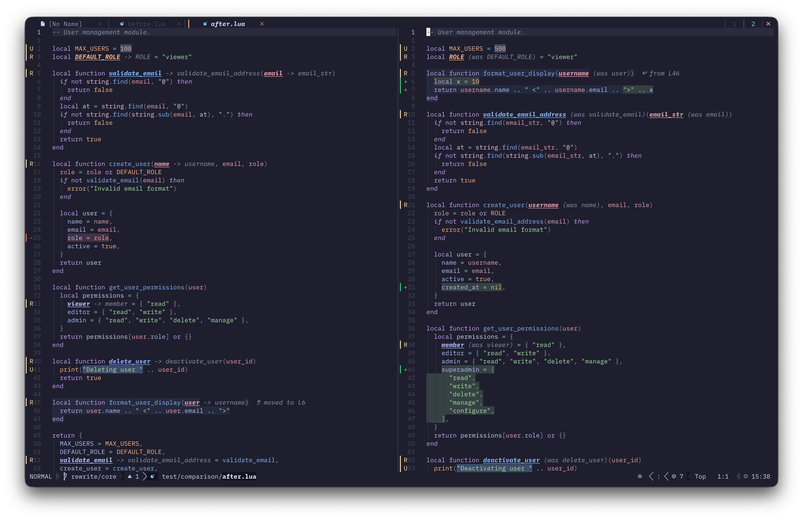

<p align="center">
  <picture>
    <source media="(prefers-color-scheme: dark)" srcset="assets/logo-dark.png">
    
  </picture>
</p>

Semantic diff for Neovim using Tree-sitter. Understands code structure to detect moved functions, updated blocks, and real changes, not just line differences.



## Features

- **Move detection** — Knows when code blocks are moved, not deleted and re-added
- **Update detection** — Highlights modified code in place
- **Insert/Delete detection** — Shows new and removed code
- **Rename detection** — Shows renamed variables and functions
- **Language agnostic** — Works with languages that have Tree-sitter parsers and diffmantic query support

## Coming Soon: diffmantic CLI

A standalone Go CLI is in active development — the same semantic diff engine, usable everywhere:

- **Terminal TUI** — Side-by-side diff viewer built with [Bubble Tea](https://github.com/charmbracelet/bubbletea)
- **git difftool** — Drop-in replacement: `git difftool -t diffmantic`
- **Editor backends** — JSON output mode for Neovim and VS Code plugins
- **CI / scripts** — Unified diff format for piping and automation

The Neovim plugin will become a thin UI client that calls the CLI

## Installation

Using [lazy.nvim](https://github.com/folke/lazy.nvim):

```lua
{
    "HarshK97/diffmantic.nvim",
    config = function()
        require("diffmantic").setup()
    end,
}
```

## Usage

Compare two files:

```vim
:Diffmantic path/to/file1 path/to/file2
```

Compare current buffer with another file:

```vim
:Diffmantic path/to/other_file
```

## How It Works

The current core follows a multi-phase AST matching pipeline:

1. **Pre-match** — Seeds stable mappings from unchanged lines
2. **Top-down matching** — Finds identical/high-confidence subtree pairs
3. **Bottom-up matching** — Expands matches using mapped descendants
4. **Recovery matching** — Iteratively recovers remaining valid mappings
5. **Action generation + analysis** — Produces move/update/insert/delete actions and refined hunks

## Requirements

- Neovim 0.9+
- Tree-sitter parser for the language you're diffing

## License

This project is licensed under the MIT License - see the [LICENSE](LICENSE) file for details.

## Acknowledgements

- GumTree repository: <https://github.com/GumTreeDiff/gumtree>
- GumTree paper: <https://hal.science/hal-04855170v1/file/GumTree_simple__fine_grained__accurate_and_scalable_source_differencing.pdf>
- Beyond GumTree paper: <https://www.researchgate.net/publication/335498580_Beyond_GumTree_A_Hybrid_Approach_to_Generate_Edit_Scripts>
